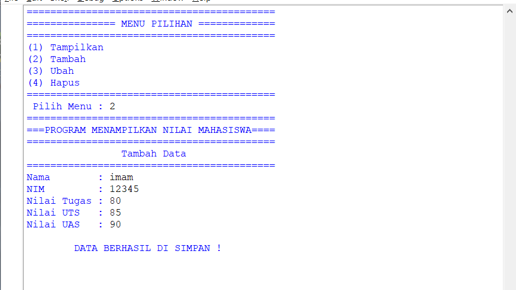

# Praktikum-6
# Tugas Praktikum
# Menampilkan Daftar Nilai Mahasiswa Mengunakan Fungsi 

1. Disini saya akan menjelaskan cara penggunaan fungsi, program yang akan saya buat yaitu untuk menampilkan data dan membuat menu pilhan untuk menampilkan, menambah, mengubah dan menghapus data. 

2. Pertama kita buat inisialisasi nama,nim,tugas,uts,uas. Selanjutnya kita buat tampilan menu pilihan menggunakan printah fungsi yang dikombinasikan dengan if else. Contoh programnya seperti berikut :

3. Selanjutnya kita buat program untuk menambahkan data, pada program ini kita menggunakan perintah fungsi yang dikombinasikan dengan list.append yang berfungsi untuk menambahkan data. berikut contoh programnya :

* Hasil Program

4. Berikutnya kita buat program untuk menampilkan data. Pada program ini kita kombinasikan fungsi def dengan perulangan for. berikut conoth programnya :

* Hasil Program

5. Untuk program menghapus data kita menggunakan fungsi if-else dan juga ada gungsi remove untuk menghapus data. Dalam menjalankan programnya kita hanya perlu memasuka urutan nomor yang akan ingin kita hapus (catatan untuk pemilihan nomer dimulai dari 0 dan seterusnya, jadi  jika ingin memilih nomer 1 maka yang dimasukan 0 dan juga seterusnya).  Berikut contoh programnya :

* Hasil Program

6. Yang terakhir kita buat progoram untuk mengubah data, untuk perintah mengubah data kita juga menggunakan perintah if-else. ketika menjalankan progamnya kita hanya perlu memasukan nomor urut yang ini kita ubah, lalu masukan nama baru yang ingin kita masukan untuk mengubah nama sebelumnnya. Berikut Contoh programnnya :

* Hasil Program

